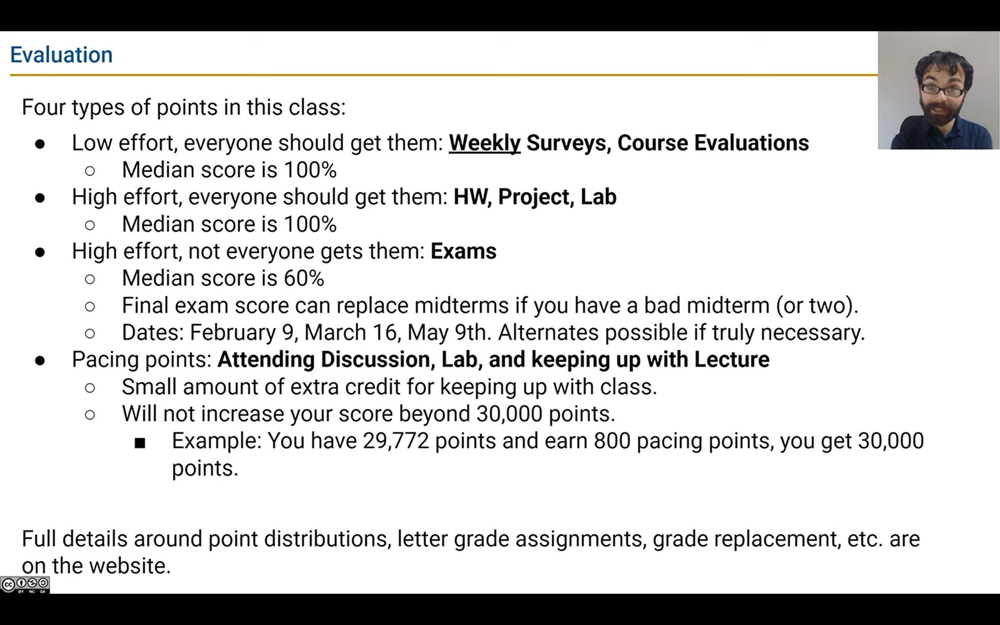

# CS61B

课件以 sp23 为基准，作业以 sp21 为基准

## 坑

### 不要死磕，多问

> **WARNING**: If something isn’t working, **do not** keep trying random things! Instead, ask for help. Your lab TA will tell you how to join the queue. They may choose to use a whiteboard queue or the [online OH queue](https://oh.datastructur.es/).
>
> In general, while you are waiting, you should **move on to the next step of the assignment**, whenever possible.
>
> [别问 XY 问题（“偷”为上策）](https://xyproblem.info)

### WSL 的坑

时间不同步：[WSL2 Clock is out of sync with Windows](https://stackoverflow.com/questions/65086856/wsl2-clock-is-out-of-sync-with-windows)

## Lect01: Intro



## +sp21 Lab01: Environment Setup (some common things)

> In-person lab sections are an excellent place to find groups.

> **WARNING**: IntelliJ is a real world, industrial software development application. There are many features that we will not use, and you will sometimes encounter situations that do not make sense. **Ask for help if you are stuck or something seems broken!** It can be very hard to guess the right thing to do in IntelliJ. Check out the [IntelliJ WTFS Guide](https://fa23.datastructur.es/materials/guides/intellij/wtfs/) for solutions to some common problems.

Beacon: a middleman that manage the viewing permission of your instructors, partners and other students
Git: help to manage code snaps and help push to GitHub
snap repo: for automatically backup and workload analysis

---

Link working repo and skeleton repos in GitHub to local machine (so there will be two remote address by `git remote -v`)

```bash
$ git clone https://github.com/Berkeley-CS61B-Student/sp21-s**.git	// for UCB students
$ git clone https://github.com/Zi-Yi-ZHANG/sp21-s626.git  // for me
```

```bash
$ git remote add skeleton https://github.com/Berkeley-CS61B/skeleton-sp21.git
```

in two repos case, `git pull` may return errors like “fatal: refusing to merge unrelated histories”, use this code:

```bash
$ git pull --rebase --allow-unrelated-histories skeleton master 
```

---

`@source` tag in code

## HW0: A Java Crash Course

> For ease of navigation, this crash course has been split up into several parts. Feel free to skim and read at whatever pace you feel comfortable with. You can start the exercises even before you finish reading part A - we recommend doing the reading and the exercises concurrently.

How to get the length of a `String` or an `Array`? [think what makes the difference]
When does `this` cannot be omitted?
static vs instance members?

How to make [starTriangle](https://practiceit.cs.washington.edu/problem/view/bjp5/chapter2/e5-starTriangle)?
Where can `null` be used and what will cause a `NullPointerException`?
What types can apply foreach loop?
`List` is an interface, how to understand this???

## Lect02: Defining and Using Classes

Constructors in Java and Python? Why we only need to recompile `DogLauncher.java`?
Understanding `public static void main(String[] args)` [command line arguments]
Do all classes have a main method? What if not? [also think about the main function in Python]
Why static methods? When will static method access instance variables?
What happens for a static variable? Is that good? [weird!]

**Design philosophy**

- **Why Java force us to use classes? Why have static methods at all?**
- **Why helper functions? How to implement the concept in design?** [largerThanFourNeighbors()]

> In the glorious modern era, it is often possible to save yourself tons of work and debugging by turning to the web for help.

## Discussion: Introduction To Java (Exam-Level)

Static vs Instance

> can you reference instance variables in static methods? Can you reference static variables in instance methods?

List, Maps, Set, Array

## sp21 Project 0: 2048

> In this project, we’re giving you a TON of starter code that uses many pieces of Java syntax that we have not covered yet, and even some syntax that we’ll never cover in our class.
>
> The idea here is that in the real world, you’ll often work with codebases that you don’t fully understand and will have to do some tinkering and experimentation to get the results you want.

private variable with public function
Model-View-Controller (MVC) pattern and Observer pattern

> If nothing pops up, it means your setup is incorrect. You should redo the above steps to make sure you didn’t miss anything, but don’t spend more than 10 minutes on this. It’s best to get setup problems fixed with a TAs help, meaning you should post on Ed or go to Office Hours. If you post on Ed, you need to tell us **everything** you’ve done/tried so we can get a clear picture of what the error is. Include screenshots of everything, especially any error messages you might get.

Intelli weird: code compiles and runs correctly, but you still get red underlines in IntelliJ, solved by `Invalidate Caches / Restart`

Note:


## Lect03: References, Recursion, and Lists

primary type vs reference type
How and when do computer storages/bits work? [usage of `new`]

> Java does not write anything into the reserved box when a variable is declared. In other words, there are no default values. As a result, the Java compiler prevents you from using a variable until after the box has been filled with bits using the `=` operator. For this reason, I have avoided showing any bits in the boxes in the figure above.

What is the golden rule for `= ` (GRoE)
State what happens for:

```java
float x = 626;

Dog y = new Dog(year = 5);

int[][] pascalsTriangle;
pascalsTriangle = new int[4][];
int[] rowZero = pascalsTriangle[0];

int[][] j = new int[3][];
int[][] k = new int[3][3];
```

What default values will be assigned?
When will reference variables lose address?
Key in writing recursion method?

## Lect04: SLLists, Nested Classes, Sentinel Nodes

What are the issues of our `IntNode`? Why? [naked linked list]
How to improve it?
What are the problems for `SLLists`
What are the advantages of `private`
Why nested classes?
Why `static` members?
When we make the nested classed `static`?
What is overloaded?

**subtleties**
What is the problem of naïve `size()`?
What is and why catching?
How to create empty list construction method?
What is the problem for empty lists?
Why sentinel node? [same structure for special cases (empty lists), invariants]

```java
public class SLList() {
    private IntNodes first;
	private IntNodes head = new IntNodes(123, first);
    private int size;
    
    private static class IntNodes() {
        int item;
        IntNodes next;
        
        public IntNodes(int x, IntNodes L) {
            item = x;
            next = L;
        }
    }
    
    public SLList(int x) {
    	first = IntNodes(x, null);
        size = 1;
    }
    
    public void addFirst(int x) {
        first = new IntNode(x, first);
        size += 1;
    }
    
    public int getFirst() {
        return first.item;
    }
    
    public void addLast(int x) {
        IntNodes p = head;
        while (p.next != null) {
            p = p.next;
        }
        p.next = new IntNode(x, null);
    }
    
    public void addLast(int x) {
        IntNodes p = first;
        
        if (p == null) {
            p = new IntNodes(x, null); 
        } else if {
        	while (p.next != null) {
            	p = p.next;
            }
            p.next = new IntNode(x, null);	// Recall the knowledge of reference variables   
        }
        
        size += 1;
    }
    
    public int size() {
        // IntNodes p = first;
        // while (p.next != null) {
        //    return 1+size(p.next);
		// }
        return size;
    }
    
    // overloaded
    public int size(IntNode p) {
        
        // if (p == null) {
        //    return 0;
        // }
        
		while (p.next != null) {	// Special case: null pointer error when p.next=null (when p is an empty list)
            return 1+size(p.next);
        }
    }
}
```

## Lect05: DLLists, Arrays

Problems for SLList?
What if we want to remove first-to-last, second-to-last or third-to-last elements?
What is going on with sentinel nodes?
generic DLLists / generic classes constructing rules of thumb
What if cases for primary types like int?

**Arrays**

What is an array?
Array's features? Compared with classes?
Array's creation, access?
Why `arraycopy` is important?
Bound checking time?
Java arrays vs other language arrays?

##  sp21 Lab 2 Setup: Library Setup (IMPORTANT)

`@Test` and `assertEquals` show errors: it is because the path you set is wrong, it is `***/cs61b/sp21-s***/library-sp21/javalib`, not `***/cs61b/sp21-s***/library-sp21`, the following posts ignore the path setting.

[CS61B 2021Spring Lab2配置问题](https://blog.csdn.net/Caarolin/article/details/126780570)

[【CS61B-21sp】lab1 git push+lab2 set up 问题和解决办法](https://blog.csdn.net/weixin_73040495/article/details/131417262)

## +sp21 Lab2: Debugging (IMPORTANT)

> Somewhere in our code there is a bug, but don’t go carefully reading the code for it! While you might be able to spot this particular bug, often bugs are nearly impossible to see without actually trying to run the code and probe what’s going on as it executes.

What are the issues of printing debugging? [logging?]
Debugging cases?
How to implement conditional debugging? 

What is unit testing and 
What is **scientific debugging**?
When to step out?

> Even without stepping INTO these functions, you should be able to tell whether they have a bug or not. That’s the glory of abstraction! Even if I don’t know how a fish works at a molecular level, there are some cases where I can clearly tell that a fish is dead.
>
> **Important: Don’t use step-in until you’ve found a call to `max` or `firstDigitEqualsLastDigit` that yields the wrong answer.**

How to code more debugging friendly? [How to locate the bug?]
Java `||`  and JavaScript `||`

## sp21 Project 1: Data Structures

> You’ll potentially save yourself a lot of trouble vs. guess-and-check with git commands. If you find yourself trying to use commands recommended by Google like `force push`, [don’t](https://twitter.com/heathercmiller/status/526770571728531456). **Don’t use force push, even if a post you found on Stack Overflow says to do it!**

What is a package and why we need them?

> Remember that the Java garbage collector will “delete” things for us if and only if there are no pointers to that object.

## Lect06: Testing @TODO: + fa23

How do programmers know their code work?
What is the unit testing and why is it good? [concrete mini-goals]
Can I use `input == expected` to check the equality of two arrays? How to comare two strings?
How to write a unit test? How can we import the tested classes?
Should the test function be `static`? [weird!]
design error: wrong abstraction

> Making silly errors like this is normal and really easy to do, so don't sweat it if you find yourself doing something similar. Iterating on a design is part of the process of writing code.

**How to apply recusive helper function?**
When does Java Visualizer do better than normal debugger?

What is the TDD process?
ADD vs. TDD vs. unit tests vs. integration testing 